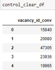

<h1 align="center"> Дизайн A/B теста для HeadHunter </h1>
<h4 align="center"> Выбор методологии и дизайна теста. Определение объекта тестирования, принципа разделения на группы и расчет эффекта, который мы можем статистически значимо отследить </h4>


**Идея:** Заменить краткое описание и логотип вакансий, которые указывает компания-работодатель на автоматические сгенерированные с помощью нейронных сетей, тем самым повысив привлекательность вакансии и увеличить количество откликов на нее

**Данные для анализа:**
1. Таблица поисковых выдач с колонками:
    
   
    
    + request_id — идентификатор serp’а
    + vacancy_id_conv  — идентификатор вакансии
    + city — город пользователя, в котором он ищет работу
    + applicant —  id соискателя, который видит SERP и может откликнуться на вакансию

2. Таблица с метрикой-скор для каждой вакансии:     
      
    
    + vacancy_id_conv — идентификатор вакансии
    + metrics_full — скор вакансии, основная метрика вакансии (кол-во откликов минус эталонное число откликов)
    + emplpyer_id — id работодателя, запостившего вакансию

**Сформулируем бизнес проблему и гипотезу:**        
***Бизнес-проблема:*** Необходимо увеличить количество откликов на вакансию   
 ***Гипотеза:*** Если заменить описание и логотип компании на сгенерированные нейросетью, то пользователи станут чаще откликаться на вакансию, метрика вакансии вырастет, а доля вакансий со скором меньше 3 уменьшиться. 

**Выбор метрик оценки результата:**     
Целевая метрика - доля вакансий, у которых скор(metric_full) меньше 3.  
Проанализируем исторические данные по вакансиям: 
Всего вакансий: 55500 
   
Из них вакансий со скором меньше 3: 8499 
   
На данный момент, до проведения теста, доля вакансий, у  которых скор(metric_full) меньше 3,  составляет 15%
   

**Анализ исторических данных**  
	Нужно учесть, что в алгоритме ранжирования вакансий в поисковой выдаче учитываются просмотры и отклики на каждую вакансию, сделанные за последние несколько дней/часов.	Т.е наиболее просматриваемые вакансии и те вакансии, на которые пользователи чаще откликаются, находятся выше в поисковой выдаче. Также наблюдается position bias. Это значит, что пользователь с большей вероятностью будет откликаться на те вакансии, которые находятся выше в поисковой выдаче.   Следовательно, чем выше вакансия в поисковой выдаче, тем больше вероятность, что ее метрика будет продолжать расти.

**Боремся с position bias**     
Общая концепция эксперимента такая: 
	Ввести рейтинг вакансии в каждом запросе – чем выше была вакансия в запросе, тем больше будет ее рейтинг (от 0 до 1), далее рассчитаем суммарный рейтинг вакансии по всем запросам. Вакансии с наивысшим рейтингом – вакансии которые чаще выпадали в поисковые запросы пользователей и чаще были на высоких позициях в нем. Если разделим все наши отранжированные вакансии на две равные группы случайным образом, чтобы в группу попадало равное кол-во вакансий с низким рейтингом и высоким, в одной из групп изменим логотип и описание вакансий с помощью нейросетей, то после проведения эксперимента мы сможем достоверно оценить в какой из групп откликаемость пользователей была выше и если окажется, что доля вакансий со скором меньше 3 уменьшилась как минимум на 5 процентов, мы сможем выкатить изменения на все ваканси.


 Альтернативный вариант проведения эксперимента: отранжировать пользователей по городам, набрать группы пользователей, содержащие равное количество пользователей из каждого города, тестовой группе пользователей показывать вакансии с измененным логотипом и описанием, а контрольной старую версию. Собрать данные о взаимодействии пользователей с вакансией.
Допустим два пользователя сделали одинаковый запрос, одному выпала поисковая выдача со старым дизайном, второму с новым, оба выбрали первую вакансию в поисковой выдаче – метрика в обоих группах одинаковая (не изменилась) из-за position baes . Как это учесть?  Введем весовой коэффициент для каждой вакансии в запросе (весовой коэффициент = позиция вакансии в запросе / кол-во вакансий в запросе), чем меньше весовой коэффициент, тем выше расположена вакансия, умножим скор вакансии на коэффициент – это уравняет все вакансии в поиске, и оценим скор вакансии в каждом запросе. Если средний скор вакансии в тестовой группе выше, и ,как следствие доля вакансий с низким скором уменьшилась, по сравнению с  контрольной группой – раскатываем фичу. 
	Этот вариант эксперимента гораздо более затратен по времени, поэтому примем первый вариант.

 **Предобработка данных** 
 ```python
 #выводим индекс поисковой выдачи в отдельный столбец
serps = serps.reset_index()
serps['index']= serps['index'].map(lambda x:x+1)

#вводим весовой коэффииент для вакансии в поисковой выдаче (порядок вакансии в поисковой выдаче/кол-во вакансий в выдаче)
serps['weight_coefficient'] = serps.groupby('request_id').index.rank() 
serps['max_rank'] = serps.groupby(['request_id']).weight_coefficient.transform('max')
serps['weight_coefficient'] = round(serps['max_rank']/serps['weight_coefficient'],3)

#избавляемся от вспомогательных столбцов
serps = serps[['request_id','vacancy_id_conv','city','applicant','weight_coefficient']]

#формируем датафрейм с рейтингом вакансий
vac_rating = serps.groupby('vacancy_id_conv', as_index=False).agg({'weight_coefficient':'sum'}) \
    .rename(columns={'weight_coefficient':'vac_rating'}).sort_values('vac_rating', ascending=False)
 ```
 Получили вакансии, распределенные по их частоте появления в поисковых выдачах и по положению в поисковой выдаче    
  

 **Выберем способ рандомизации и определим параметры выборки**  
Кого распределяем на группы?    
- Вакансии

Как распределяем на группы?
 - Вакансии делим на две равные группы: с низким рейтингом и с высоким (по 0,5 квантилю), из каждой группы случайным образом выбираем вакансии из каждой группы

Какого соотношение групп?
- Разделим вакансии на две *равные* группы   

  
```python
low_rating = vac_rating.query('vac_rating<=29.4173')
high_rating  = vac_rating.query('vac_rating > 29.417')
```

**Анализ полученных групп**  
Проверим полученные данные в каждой группе. Вакансия с низким рейтингом может иметь высокий скор, если она не часто выпадала в поисковой выдаче пользователя, но часто была на первых позициях и пользователи часто на нее откликались. И наоборот для вакансий с высоким рейтингом соответственно.

Для проверки соединим датафрейм с рейтингом с датафреймом с metric-full вакансией и построим бокс-плот для обоих групп вакансий
```python
union_rating = vac_rating.merge(vacs_metrics, on='vacancy_id_conv')
low_union_rating = union_rating.query('vac_rating<=29.4173')
high_union_rating = union_rating.query('vac_rating > 29.4173')
```
  
Как видно на графике, в обоих группах есть сильные выбросы, а медианные значения метрики довольно близко друг к другу. Обработаем данные в наших группах еще раз

Из группы вакансий с высоким рейтингом исключим все вакансии с метрикой ниже 3, а из группы вакансий с низким рейтингом исключим все вакансии с метрикой выше 3.
Проверим данные, построив box-plot
```python
high_rating_clear = high_rating.merge(vacs_metrics, on='vacancy_id_conv').query('metric_full > 3')
low_rating_clear = low_rating.merge(vacs_metrics, on='vacancy_id_conv').query('metric_full <= 3')

pd.concat([low_rating_clear.metric_full, high_rating_clear.metric_full], axis=1).boxplot()
```
 

Теперь все ОК. Набранные в группы данные явно отражают вакансии с высоким рейтингом и высокой метрикой, и вакансии с низким рейтингом и низкими метриками

**Распределяем вакансии на группы для теста**   
Т.к вакансий с низким рейтингом и низкой метрикой оказалось меньше, чем успешных вакансий (high_rating_clear = 26498, low_rating_clear = 7255), будем набирать группы для эксперимента ориентируясь на меньшую группу. 
В тестовую и контрольную группе будет не более 7255 вакансий. Необходимо что бы и в тестовой и контрольной группе было равное количество вакансий с низким и высоким рейтингом, а также чтобы вакансий в группах не повторялись.
Набираем группы:
```python
control_clear = set()
for i in range(0, len(low_rating_clear.vacancy_id_conv),2):
    control_clear.add(low_rating_clear.reset_index().vacancy_id_conv[i])
while len(control_clear) < 7255:
    control_clear.add(np.random.choice(high_rating_clear.vacancy_id_conv))

test_clear = set()
for i in range(1, len(low_rating_clear.vacancy_id_conv),2):
    test_clear.add(low_rating_clear.reset_index().vacancy_id_conv[i])
free_high_rating_vacs = list(set(high_rating_clear.vacancy_id_conv)-control_clear)
while len(test_clear) < 7255:
    test_clear.add(np.random.choice(free_high_rating_vacs))

#проверка на несовпадение двух групп
control_clear&test_clear
```
Формируем датафреймы с тестовой и контрольной группой:
```python
test_clear_df = pd.DataFrame(test_clear).rename(columns={0:'vacancy_id_conv'}).sample(frac=1).reset_index(drop=True)

control_clear_df = pd.DataFrame(control_clear).rename(columns={0:'vacancy_id_conv'}).sample(frac=1).reset_index(drop=True)
```

 

**Рассчитаем какой MDE мы сможем статистически значимо отследить:**     
Выразим MDE из формулы: 

         
Размеры тестовой и контрольной группы: 7255     
Рассчитаем величину эффекта, который мы сможем обнаружить с вероятностью 80%, Для вычислений используем уровень значимости 5%.  
Дисперсии метрики вакансии в контрольной и тестовой группах:
```python
control_metric_clear = control_clear_df.merge(vacs_metrics, on='vacancy_id_conv')
control_metric_clear.metric_full.var()
# 3.3575292506469276

test_metric_clear = test_clear_df.merge(vacs_metrics, on='vacancy_id_conv')
test_metric_clear.metric_full.var()
# 3.284738739083842
```


**Подведем итог**
Гипотеза:
Если заменить описание и логотип компании на сгенерированные нейросетью, то пользователи станут чаще откликаться на вакансию, метрика вакансии вырастет, а доля вакансий со скором меньше 3 уменьшиться. 
Целевая метрика - доля вакансий, у которых скор(metric_full) меньше 3 . До проведения теста доля таких вакансий -15%.

Вакансии для эксперимента делим на две равные группы по 7255 в каждой группе

С уровнем значимости 5% и с вероятностью зафиксировать статистически значимое отклонение 80% при размере выборки 7255, если гипотеза верна – мы получим минимальный эффект (на metric_full) = 8,48%
При заданных условиях невозможно рассчитать длительность теста, т.к данные о трафике пользователей отсутствуют в исходных данных 
